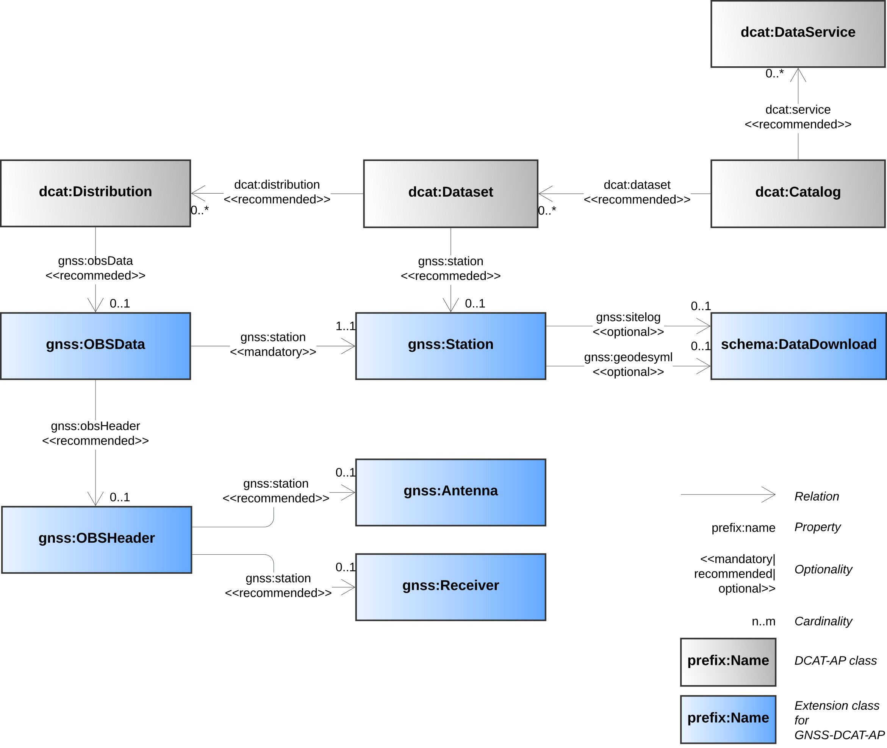

# GNSS-DCAT-AP

A DCAT-AP extension for GNSS observation data (GNSS-DCAT-AP) to facilitate GNSS data exchange. In particular, this metadata application profile aims at facilitating the exchange of GNSS RINEX observation data in order to increase their Findability, Accessibility, Interoperability, and Re-usability (FAIR)[^1].

GNSS-DCAT-AP adds additional support for the following entities:
* GNSS observation data file (RINEX) and its header
* GNSS station
* GNSS antenna and receiver
* GNSS observation data generating software
* GNSS data repository

GNSS-DCAT-AP is currently used for the metadata attached to daily RINEX files accessible via [https://gnss.be/opendataportal/](https://gnss.be/opendataportal/) and its RESTful API.

 *A simplified ULM class diagram providing a partial view of GNSS-DCAT-AP, which extends DCAT-AP 2.1.0 by adding new classes (**in blue**) and properties. Only the GNSS-DCAT-AP classes populated so far are shown.*

 

 [^1]: More details [here](http://doi.org/10.1007/s10291-025-01868-y)