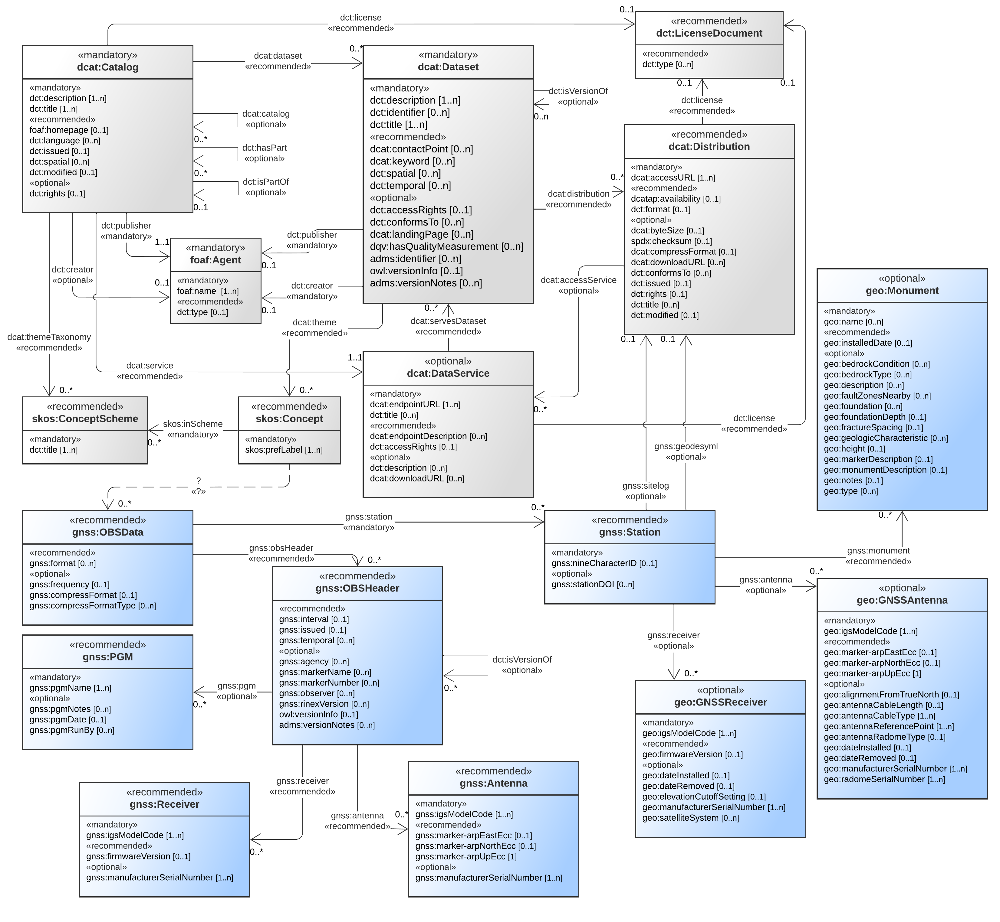

# GNSS-DCAT-AP

.. image:: https://zenodo.org/badge/DOI/10.5281/zenodo.7777569.svg
   :target: https://doi.org/10.5281/zenodo.7777569
   :alt: Citable DOI

First draft of a DCAT-AP extension for GNSS observation data (GNSS-DCAT-AP) to facilitate GNSS data exchange. This proposal aims at facilitating the exchange of GNSS RINEX observation data in order to increase their Findability, Accessibility, Interoperability, and Re-usability (FAIR).

GNSS-DCAT-AP adds additional support for the following entities:
* GNSS observation data file (RINEX) and its header
* GNSS station
* GNSS antenna and receiver
* GNSS observation data generating software

 *A Simplified UML Class Diagram of the GNSS-DCAT-AP model. It extends DCAT-AP 2.1.0 introducing additional classes (**in blue**) and relationships*
 
